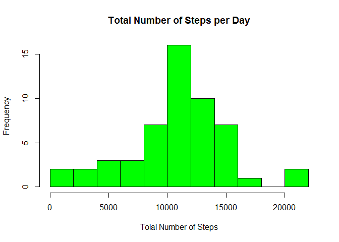
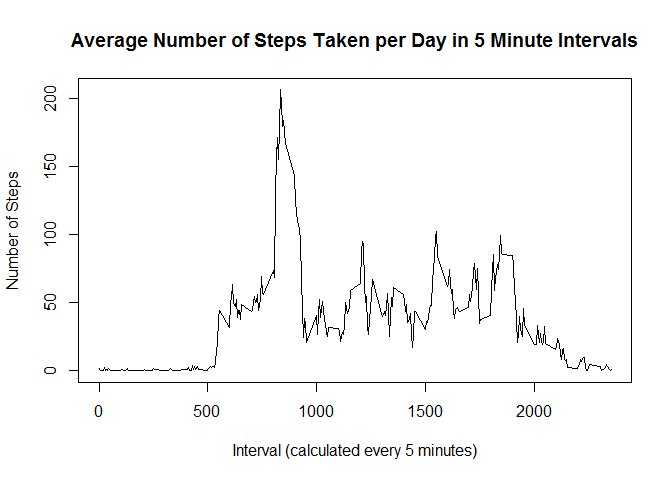
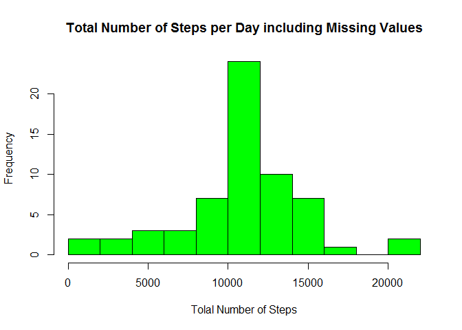
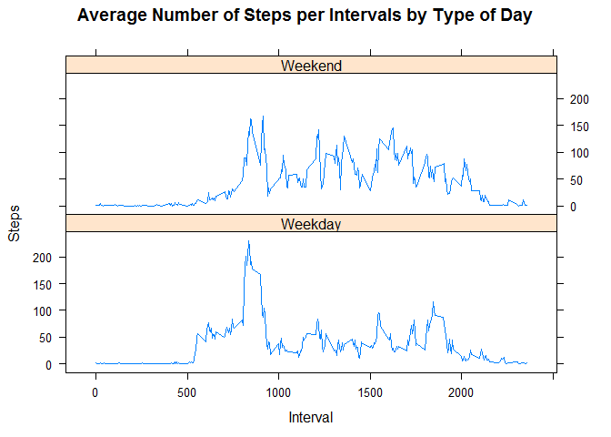

# Reproducible Research Assignment 1
Kristina Elliott  
##Loading the data
First you will want to download the dataset and place into a folder on your computer. Then set your work directory to folder where you placed the dataset.
I am working in Window and in RStudio. 

Save the data into a variable. 

```r
ActivityData <- read.csv("activity.csv")
head(ActivityData)
```

```
##   steps       date interval
## 1    NA 2012-10-01        0
## 2    NA 2012-10-01        5
## 3    NA 2012-10-01       10
## 4    NA 2012-10-01       15
## 5    NA 2012-10-01       20
## 6    NA 2012-10-01       25
```

##What is mean total number of steps taken per day?
1. Calculate the total number of steps taken per day while ignore the missing values.

```r
TotalNumSteps <- aggregate(steps~date, ActivityData, sum)
head(TotalNumSteps)
```

```
##         date steps
## 1 2012-10-02   126
## 2 2012-10-03 11352
## 3 2012-10-04 12116
## 4 2012-10-05 13294
## 5 2012-10-06 15420
## 6 2012-10-07 11015
```
2. Make a histogram of the toal number of steps taken each day. 

```r
hist(TotalNumSteps$steps, main = "Total Number of Steps per Day", xlab = "Tolal Number of Steps", ylab = "Frequency", breaks = 10, col = "green")
```

<!-- -->

3. Calculate and report the mean and median of the total number of steps taken per day.

```r
MeanTotalSteps <- as.integer(mean(TotalNumSteps$steps, na.rm = TRUE))
MedianTotalSteps <- median(TotalNumSteps$steps, na.rm = TRUE)
```
The mean of the total number of steps taken per day is 10766. The median of the total number of steps taken per day is 10765.

##What is the average daily activity pattern?
1. Make a time series plot of the 5-minute interval and the average number of steps taken, averaged across all days.

```r
Interval <- aggregate(steps~interval, ActivityData, mean)
plot(Interval$interval, Interval$steps, type = "l", xlab = "Interval (calculated every 5 minutes)", ylab = "Number of Steps", main = "Average Number of Steps Taken per Day in 5 Minute Intervals")
```

<!-- -->

2. Which 5 minute interaval, on average across all the days in the data set contains the maximum number of steps?

```r
MaxInterval <- Interval[which.max(Interval$steps),1]
```
The interaval containing the maximum number of steps is 835.

##Imputing missing values
1. Calculate and report the total number of missing values in the dataset.

```r
NumofNA <- sum(is.na(ActivityData$steps))
```
The total number of missing values in the dataset is 2304.

2. Devise a strategy for filling in all of the missing values in the dataset. 

Find the mean of the data with the same interval to substute in for missing values.

3. Create a new dataset that is equal to the original dataset but with the missing data filled in.

```r
ActivityDataNoNA <- ActivityData
NAValues <- is.na(ActivityDataNoNA$steps)
average_interval <- tapply(ActivityDataNoNA$steps, ActivityDataNoNA$interval, mean, na.rm=TRUE, simplify = TRUE)
ActivityDataNoNA$steps[NAValues] <- average_interval[as.character(ActivityDataNoNA$interval[NAValues])]
```

4. Make a histogram of the total number of steps taken each day and calculate and report the mean and median total number of steps taken per day.

```r
TotalNumStepsNoNA <- aggregate(steps~date, ActivityDataNoNA, sum)

hist(TotalNumStepsNoNA$steps, main = "Total Number of Steps per Day including Missing Values", xlab = "Tolal Number of Steps", ylab = "Frequency", breaks = 10, col = "green")
```

<!-- -->

```r
MeanTotalStepsNoNA <- as.integer(mean(TotalNumStepsNoNA$steps, na.rm = TRUE))

MedianTotalStepsNoNA <- as.integer(median(TotalNumStepsNoNA$steps, na.rm = TRUE))
```

The mean of the total number of steps taken per day is 10766. The median of the total number of steps taken per day is 10766.

Do these values differ from the estimates from the first part of the assignment? 
   
    Mean with missing values : 10766 
    Mean with No missing values: 10766
    Median with missing values : 10765 
    Median with No missing values: 10766    

What is the impact of imputing missing data on the estimates of the total daily number of steps? 
    There was not much impact from the missing data.


##Are the differences in activity patterns between weekdays and weekends?
1. Create a new factor variable in the dataset with two levels - "weekday" and "weekend" indicating whether a given date is a weekday or weekend day.

```r
weekend <- c("Saturday", "Sunday")
ActivityDataNoNA$DW <- as.factor(ifelse(is.element(weekdays(as.Date(ActivityDataNoNA$date)), weekend), "Weekend", "Weekday"))
```
2. Make a panel plot containing a time series plot of the 5-minute interval and the average number of steps taken, averaged across all weekday days or weekend days.

```r
IntervalNADW <- aggregate(steps~interval + DW, ActivityDataNoNA, mean)
library(lattice)
xyplot(IntervalNADW$steps~IntervalNADW$interval|IntervalNADW$DW,main = "Average Number of Steps per Intervals by Type of Day", xlab = "Interval", ylab = "Steps", layout = c(1,2), type = "l")
```

<!-- -->
